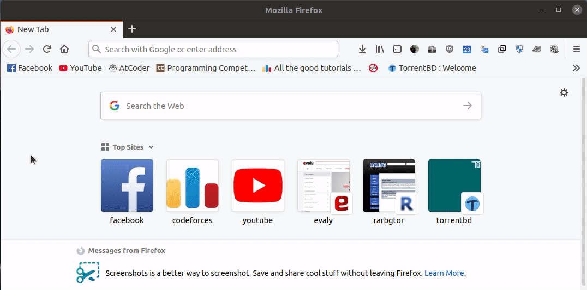

# CF---Input-Output-Parsing-Compiling-Testing
A tool that helps and saves your time to generate all your cf problems with your template file and also compile &amp; check your code with the outputs

# LINUX
# Prerequisite:

    [ installing python 3 ]
    sudo apt-get install python3.8 
    
    [ installing pip ]
    sudo apt install python3-pip
    
    [ python necessary tools ]
    pip3 install requests
    pip3 install BeautifulSoup4
    
# Download:
    [ downloading cf-input-output-parsing-tool ]
    git clone https://github.com/turin1602101/CF---Input-Output-Parsing.git
    
# Setup:
    [change current directory to download directory]
    cd CF---Input-Output-Parsing/
    ./run

# How to Use:
    For parsing all cf contest input output:
    gen -p [contest link]
    Example :
        gen -p https://codeforces.com/contest/1369
        
    For Compiling & Testing:
    gen -c [any generated file name]
    Example :
        gen -c A
        gen -c F
